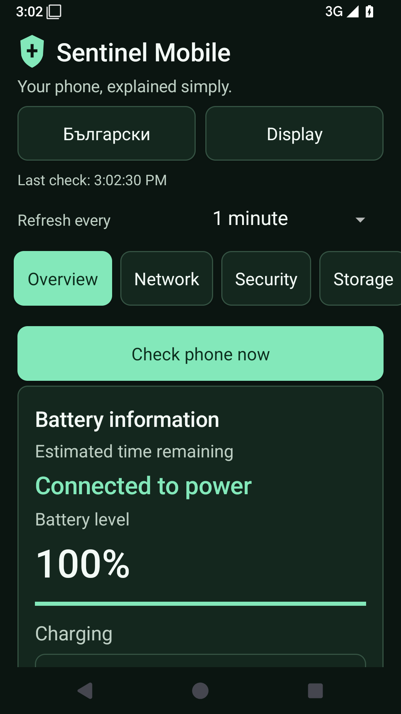
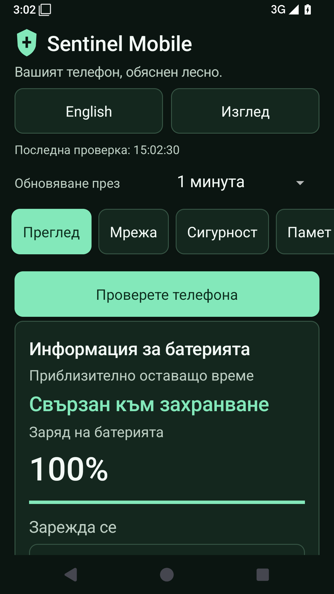
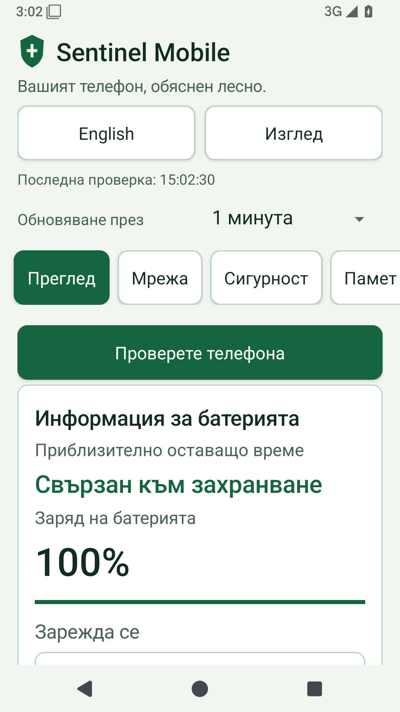

# Sentinel Mobile — English & Bulgarian

A native Android phone-health app adapted for older adults. Large text, generous buttons, clear explanations, dark/light themes, and an English / Български switch. All checks run on the phone.

## Downloads

- [Install Android APK 1.0.1](https://raw.githubusercontent.com/StanPaunov/SentinelMobile/main/downloads/Sentinel-Mobile-Elders-1.0.1.apk)
- [Download source](https://github.com/StanPaunov/SentinelMobile/archive/refs/heads/main.zip)
- [SHA-256 checksums](downloads/SHA256SUMS.txt)
- [Test results and coverage limits](TEST-RESULTS.md)
- [Website](https://stanpaunov.github.io/SentinelMobile/) · [Desktop companion](https://stanpaunov.github.io/PCSentinelNet/)

## Install and use

Install **Sentinel-Mobile-Elders-1.0.1.apk** on Android 8 or newer. Android may ask you to allow installation from the app opening the APK. This release uses the existing Sentinel Mobile signing key.

- Tap **Български** or **English** to change language.
- Tap **Display / Изглед** to change the theme or choose one of three text sizes.
- Set **Refresh every / Обновяване през** to Never, 5 seconds, 30 seconds, or 1 minute. The default is 1 minute.
- Tap a section or swipe left/right across its content. The section bar scrolls horizontally, so long labels stay readable.
- Tap **Check phone now / Проверете телефона** for fresh readings.
- Open **Battery details / Подробности за батерията** for temperature, voltage, health, power source, and an explanation of estimates.
- Location is optional. If enabled, coordinates can be copied with the copy button or by pressing and holding them.
- **Help & privacy / Помощ и поверителност** explains the controls inside the app.

## На български

Приложение за Android, съобразено с нуждите на възрастни хора: голям текст, удобни бутони, ясни обяснения и избор между български и английски език.

Инсталирайте **Sentinel-Mobile-Elders-1.0.1.apk** на телефон с Android 8 или по-нова версия. Тази версия е подписана със съществуващия Ви ключ за Sentinel Mobile.

Използвайте **Изглед**, за да промените режима и размера на текста. Натиснете **Проверете телефона** за нова проверка. Изберете раздел или плъзнете наляво или надясно. Местоположението е по избор. За копиране натиснете бутона под координатите или ги натиснете и задръжте.

Информацията остава на телефона. Няма профили, реклами, проследяване или изпращане на данни. Автоматичните проверки работят само докато приложението е отворено.

## Privacy and measurement limits

Only network-state and coarse/fine location permissions are requested. There is no INTERNET permission, analytics, telemetry, advertising, file scan, installed-app list, or broad package visibility.

Battery time is an approximation. The app tries Android's system prediction on API 31+ and handles unavailable or restricted responses. Its fallback requires at least one minute, three percentage points of discharge, and consistent discharge intervals. Charging, unstable readings, long observation gaps, or insufficient data produce no numerical estimate. Measurements are kept only for the foreground session. See [Android PowerManager](https://developer.android.com/reference/android/os/PowerManager#getBatteryDischargePrediction()).

Network activity is aggregate traffic, not a connection or port scanner. Android may restrict interface and settings information. Security results are informational and do not guarantee a secure device. The unknown-app installation check concerns Sentinel Mobile itself, which does not request permission to install apps.

## Build from source

Java and the standard Android SDK; no Compose, AndroidX, or runtime third-party dependencies.

- Package: com.stanpaunov.sentinelmobile
- Version: 1.0.1 (code 2)
- Minimum / target / compile SDK: 26 / 36 / 36
- Build tools: Gradle 9.0.0, Android Gradle Plugin 8.7.3; JDK 17 or newer
- Both language resources ship together in the AAB (bundle.language.enableSplit = false).

Set JAVA_HOME and ANDROID_HOME for your machine, then run:

    gradlew.bat clean assembleDebug lint assembleDebugAndroidTest

For release signing, set these environment variables locally before running "gradlew.bat assembleRelease bundleRelease":

    SENTINEL_RELEASE_STORE_FILE
    SENTINEL_RELEASE_STORE_PASSWORD
    SENTINEL_RELEASE_KEY_ALIAS
    SENTINEL_RELEASE_KEY_PASSWORD

The release build fails if any credential is missing. Signing keys and private passwords are not included in the source archive. Keep using your existing key for updates. For subsequent Play Store uploads, choose a version code higher than the one already published; this deliverable retains the prompt's requested code 2.

Optional SENTINEL_TEST_STORE_FILE, SENTINEL_TEST_STORE_PASSWORD, and SENTINEL_TEST_KEY_PASSWORD variables can supply a local Android debug keystore (alias androiddebugkey). They never affect release signing.

Run the dependency-free battery tests:

    javac -d test-classes app/src/main/java/com/stanpaunov/sentinelmobile/BatteryEstimator.java tests/BatteryEstimatorTest.java
    java -ea -cp test-classes com.stanpaunov.sentinelmobile.BatteryEstimatorTest

The framework-only device test runner is in app/src/androidTest. It uses simulated coordinates; grant location permission on the test emulator before running it:

    adb install -r app/build/outputs/apk/debug/app-debug.apk
    adb install -r app/build/outputs/apk/androidTest/debug/app-debug-androidTest.apk
    adb shell pm grant com.stanpaunov.sentinelmobile android.permission.ACCESS_COARSE_LOCATION
    adb shell pm grant com.stanpaunov.sentinelmobile android.permission.ACCESS_FINE_LOCATION
    adb shell cmd location set-location-enabled true
    adb shell am instrument -w com.stanpaunov.sentinelmobile.test/com.stanpaunov.sentinelmobile.SmokeRunner

See TEST-RESULTS.md for the checks actually completed and remaining device coverage.
